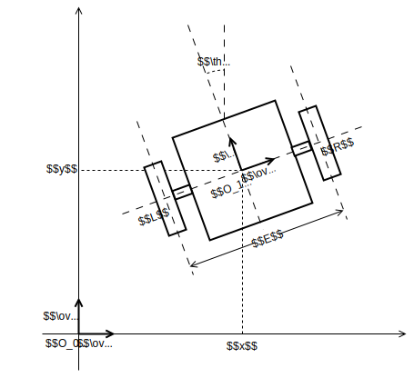

# Two wheels vehicle kinematic model

This repo give and demonstrate the kinematic model of a single axle two wheels vehicle.

## Parameters




The ground has the $R_0 (O_0, \overrightarrow{x_0}, \overrightarrow{y_0}, \overrightarrow{z_0} )$ frame such as $\overrightarrow{z_0}$ is vertical ascending.

The vehicle has the $R_1 (O_1, \overrightarrow{x_1}, \overrightarrow{y_1}, \overrightarrow{z_1} )$ frame such as :
* $O_1$ belongs the the axle, equidistant from the two wheels.
* $\overrightarrow{x_1}$ is toward the right of the vehicle.
* $\overrightarrow{y_1}$ is toward the front of the vehicle.
* $\overrightarrow{z_1} = \overrightarrow{z_0}$.

Let $L$ be the point at the center of the left wheel.  
Let $R$ be the point at the center of the right wheel.  
Let $E$ be the track of the vehicle, i.e. the distance $\overline{LR}$.

The position of the vehicle within the $R_0$ frame is given by the parameters $x$, $y$ and $\theta$ such as :
* $\overrightarrow{O_0O_1} = x \times \overrightarrow{x_0} + y \times \overrightarrow{y_0}$
* $\theta = \left(\overrightarrow{x_0}, \overrightarrow{x_1} \right) $

The aim of this study is to give the time derivative of $x$, $y$ and $\theta$ as a function of the speed of the wheels ($V_L$ and $V_R$) and the geometry of the vehicle.

## Solid kinematics formula

According to the solid kinematics formula, one has :
```math
\overrightarrow{V_{L\in R_1/R_0}} = \overrightarrow{V_{R\in R_1/R_0}} + \overrightarrow{LR} \wedge \overrightarrow{\Omega_{R_1/R_0}}
```

Within the $R_1$ frame, it can be written :
```math
\begin{align}
V_L \overrightarrow{y_1} &= V_R \overrightarrow{y_1} + E \overrightarrow{x_1} \wedge \dot{\theta} \overrightarrow{z_1} \\
&= V_R\overrightarrow{y_1} - E \dot{\theta} \overrightarrow{y_1} 
\end{align}
```

So one has :
```math
\dot{\theta} = \frac{V_R - V_L}{E}
```

According to the solid kinematics formula, one also has :

```math
\begin{align}
\overrightarrow{V_{L\in R_1/R_0}} &= \overrightarrow{V_{O_1\in R_1/R_0}} + \overrightarrow{LG} \wedge \overrightarrow{\Omega_{R_1/R_0}} \\
V_L \overrightarrow{y_1} &= \dot{x} \overrightarrow{x_0} + \dot{y} \overrightarrow{y_0} + \frac{E}{2}\overrightarrow{x_1} \wedge \dot{\theta} \overrightarrow{z} \\
&= \dot{x} \overrightarrow{x_0} + \dot{y} \overrightarrow{y_0} - \frac{E}{2} \dot{\theta} \overrightarrow{y_1}
\end{align}
```

Knowing that $\overrightarrow{y_1} = -\sin \theta \overrightarrow{x_0} + \cos \theta \overrightarrow{y_0}$

On $\overrightarrow{x_0}$ :

```math
\begin{align}
& -\sin \theta V_L = \dot{x} + \frac{E}{2} \dot{\theta} \sin \theta \\
\Leftrightarrow & \dot{x} = -\sin{\theta} \times \left( \frac{E}{2} \dot{\theta} + V_L \right) \\
\Leftrightarrow & \dot{x} = -\sin{\theta} \times \left( \frac{E}{2} \frac{V_R - V_L}{E} + V_L \right) \\
\Leftrightarrow & \dot{x} = - \sin{\theta} \times \left( \frac{V_L + V_R}{2} \right)
\end{align}
```

On $\overrightarrow{y_0}$ :

```math
\begin{align}
& \cos{\theta} V_L = \dot{y} - \frac{E}{2} \dot{\theta} \cos{\theta} \\
\Leftrightarrow & \dot{y} = \cos{\theta} \times \left( V_L + \frac{E}{2} \dot{\theta} \right) \\
\Leftrightarrow & \dot{y} = \cos{\theta} \times \left( V_L + \frac{E}{2} \frac{V_R - V_L}{E} \right) \\
\Leftrightarrow & \dot{y} = \cos{\theta} \times \left( \frac{V_L + V_R}{2}  \right)
\end{align}
```

Finally the kinematic model is given by :
```math
\left\{
\begin{aligned} 
\dot{x} &= - \sin{\theta} \times \left( \frac{V_L + V_R}{2} \right) \\
\dot{y} &= \cos{\theta} \times \left( \frac{V_L + V_R}{2} \right) \\
\dot{\theta} & = \frac{V_R - V_L}{E}
\end{aligned} 
\right.
```
